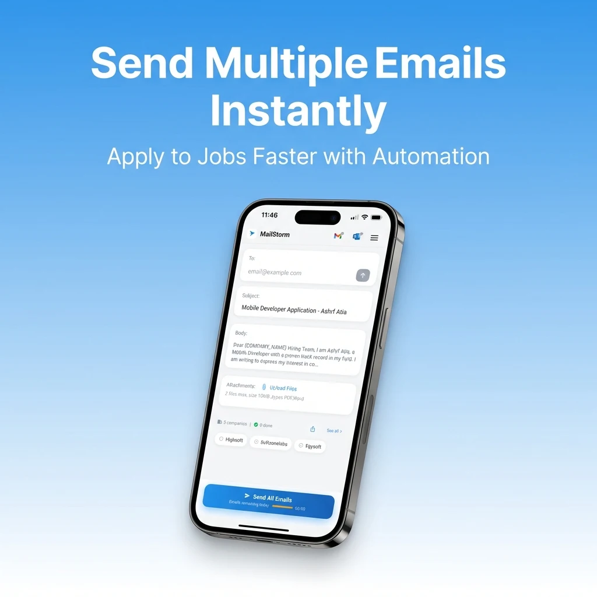

<div align="center">

  <p align="center">
    
    
  </p>

  

  <h1>MailStorm — AI-Powered Job Application Emailer</h1>

  <p>
    <strong>Send personalized, AI-generated job application emails to hundreds of companies — with one tap.</strong><br>
    Every email is unique. Every email is sent from <em>your own</em> Gmail or Outlook account — straight to HR's inbox, not spam.
  </p>

  <p>
    <a href="https://play.google.com/store/apps/details?id=com.mailstorm.app">
      
    </a>
  </p>

  <p>
    <a href="https://youtu.be/aUykEzuIu7o">
      
    </a>
  </p>

  <p>
    
    
    
    
    
  </p>

</div>

---

## 📷 Screenshots

<table>
  <tr>
    <td></td>
    <td></td>
    <td></td>
  </tr>
  <tr>
    <td></td>
    <td></td>
    <td></td>
  </tr>
  <tr>
    <td></td>
    <td></td>
    <td></td>
  </tr>
  <tr>
    <td></td>
    <td></td>
    <td></td>
  </tr>
  <tr>
    <td></td>
    <td></td>
    <td></td>
  </tr>
  <tr>
    <td></td>
    <td></td>
    <td></td>
  </tr>
</table>

---

## 💡 The Problem

Landing a job starts with reaching out — but writing the same email to 50 companies is exhausting and nobody does it well. You either batch-send a generic email (that gets ignored) or spend hours writing individual ones (that burns you out).

**MailStorm solves this.** Upload your CV once. The AI reads it and writes a personalized subject line and email body based on your _real_ experience. Add companies by tapping any email address you find — on LinkedIn, a company website, or anywhere else. Then send to your entire list with one tap. **Every email is unique to each company.**

The critical difference: emails are sent through **your own Gmail or Outlook account** directly to the company's HR inbox — not through a third-party server, not as bulk mail. Each recipient gets a personally addressed email written around your background and their company name.

---

## ✨ Key Features

| Feature | Description |
|---|---|
| **🤖 AI Email Generation** | Gemini 2.5 Flash Lite parses your CV (PDF) and generates a professional, personalized subject + body per company |
| **📄 Smart CV Parsing** | AI extracts your name, role, skills, achievements, and contact links — then crafts a 5-paragraph email following proven cold-email structure |
| **🔗 Multi-Provider OAuth** | Connect Gmail (native Google Sign-In), Outlook (AppAuth + Microsoft Graph API), or Yahoo — emails are sent from _your_ account |
| **⚡ One-Tap Bulk Send** | Send to your entire company list simultaneously — each email personalized with `{COMPANY_NAME}` placeholders auto-filled |
| **🔗 Deep Link Integration** | Tap any `mailto:` link from LinkedIn, job boards, or browsers → MailStorm opens instantly and adds the company to your list |
| **📊 Activity Heatmap** | GitHub-style contribution heatmap tracking daily application volume, success rates, and streaks |
| **🔔 Smart Notifications** | Follow-up reminders for companies you've applied to, plus daily motivation nudges |
| **📝 Rich Text Editor** | Professional email formatting with `flutter_quill` (Delta-based document model) |
| **📂 CSV Import** | Bulk import companies from spreadsheets with validation middleware |
| **🔐 Encrypted Sharing** | Share company lists as AES-256-CBC encrypted `.mailstorm` files — import with one tap from WhatsApp/Telegram |
| **🌍 11 Languages** | English, Arabic, German, Spanish, French, Hindi, Italian, Japanese, Portuguese, Russian, Turkish |
| **🎭 Interactive Onboarding** | 5-step cinematic onboarding: Pain → Resume Upload → Add Company → Fire Storm → Superpowers |

---

## 🏗 Architecture

### Feature-First Clean Architecture + Riverpod

The codebase follows **feature-first Clean Architecture** with strict separation of concerns. Each feature is self-contained with its own data, domain, and presentation layers.

```
lib/
├── core/
│   ├── config/               # Environment configuration (API keys, secrets)
│   ├── const/                # App-wide constants
│   ├── di/                   # Dependency injection setup
│   ├── exceptions/           # Sealed exception hierarchy (9 typed exceptions)
│   ├── middleware/            # 12 validation & processing middleware
│   ├── models/               # Shared domain models
│   ├── router/               # GoRouter configuration (15+ routes)
│   ├── services/             # Core shared services
│   ├── theme/                # Design system (colors, typography, theme)
│   ├── utils/                # Utilities & logging
│   └── widgets/              # Reusable UI components
│
├── features/
│   ├── activity/             # Activity heatmap & analytics tracker
│   ├── ai_profile/           # AI-powered user profile from CV
│   ├── companies/            # Company list management
│   ├── email_editor/         # Rich text editor (flutter_quill)
│   ├── email_providers/      # Provider connection UI
│   ├── follow_up/            # Follow-up reminder system
│   ├── home/                 # Main dashboard (62 files)
│   ├── job_application/      # Core sending flow (109 files)
│   ├── mailstorm/            # .mailstorm file import/export
│   ├── onboarding/           # 5-step interactive onboarding (43 files)
│   ├── settings/             # Settings & contact
│   └── splash/               # Splash screen
│
├── services/
│   ├── ai/                   # Gemini AI service (CV parsing, email generation)
│   ├── connectivity/         # Network state monitoring
│   ├── database/             # Drift SQL database (8 tables)
│   ├── deep_link/            # mailto: & .mailstorm deep link handling
│   ├── email/                # Email provider abstraction (Gmail SMTP / Outlook Graph API)
│   ├── mailstorm/            # Encryption, file I/O, import/export service
│   ├── navigation/           # Routing service
│   ├── notifications/        # Awesome Notifications (follow-ups, daily reminders)
│   ├── oauth/                # Gmail, Microsoft, Yahoo OAuth + token refresh
│   ├── rate_limit/           # API rate limiting
│   ├── smart_features/       # Smart subject generation & template service
│   ├── storage/              # Secure Storage + SharedPreferences
│   ├── tutorial/             # Tutorial coach marks
│   └── update/               # In-app update service
│
├── l10n/                     # 11 language translation files
├── app.dart
└── main.dart
```

---

## 🛠 Technology Stack

| Layer | Technology | Why |
|---|---|---|
| **Framework** | Flutter 3.0+ / Dart | Cross-platform with native performance |
| **State Management** | Riverpod + `riverpod_generator` | Compile-safe, testable, provider-based |
| **Navigation** | GoRouter | Declarative routing with deep link support |
| **Database** | Drift (SQLite) | Type-safe SQL with migrations & code generation |
| **AI Engine** | Google Gemini 2.5 Flash Lite (`google_generative_ai`) | CV parsing + email generation with structured JSON output |
| **OAuth** | `google_sign_in` + `flutter_appauth` | Native Google Sign-In & AppAuth for Microsoft |
| **Email** | `mailer` (SMTP) + Microsoft Graph API (REST) | Gmail via SMTP, Outlook via REST |
| **Rich Text** | `flutter_quill` | Delta-based document model for professional emails |
| **Local Storage** | Flutter Secure Storage + SharedPreferences | Encrypted credential storage |
| **Encryption** | `encrypt` (AES-256-CBC) | Secure `.mailstorm` file sharing |
| **Deep Linking** | Platform MethodChannel + `receive_sharing_intent` | Handle `mailto:` and `.mailstorm` file intents |
| **Notifications** | Awesome Notifications | Scheduled follow-ups and daily reminders |
| **Animations** | `flutter_animate` + Lottie + `shimmer` | Smooth, cinematic UI transitions |
| **Crash Reporting** | Sentry (`sentry_flutter`) | Production error monitoring |
| **Localization** | `easy_localization` | 11 languages with RTL support |
| **PDF Processing** | `pdfrx` | CV rendering and preview |
| **Typography** | Google Fonts (Cairo) | Consistent cross-locale typography |
| **In-App Update** | `in_app_update` | Force-update mechanism |

---

## 🧠 AI Architecture — Gemini Integration

MailStorm uses **Google Gemini 2.5 Flash Lite** to transform a raw PDF resume into a complete, ready-to-send job application email.

### How It Works

```
CV (PDF bytes) → Gemini Vision API → Structured JSON → Email Sanitizer → Ready Email
```

1. **PDF Upload** — The user uploads their CV during onboarding. The raw PDF bytes are sent directly to Gemini's multimodal content API.
2. **System Prompt** — A carefully engineered system prompt instructs Gemini to:
   - **Validate** that the document is actually a resume (rejects random files, images, prompt injection attacks)
   - **Extract** name, role, years of experience, top 3 hard skills, key achievements, LinkedIn/GitHub URLs
   - **Generate** a 5-paragraph email following a proven cold-email framework (Hook → Value → Proof → Fit → CTA)
3. **Output** — Gemini returns structured JSON with `subject`, `body`, `status`, `candidate_name`, and `role`
4. **Sanitization** — `EmailSanitizer` cleans the output (removes markdown artifacts, normalizes placeholders)
5. **Personalization** — At send time, `{COMPANY_NAME}` is replaced with each recipient's actual company name

### Resilience Strategy

```dart
// Dual API key fallback with automatic retry
while (attempts < maxAttempts) {
  final currentApiKey = isFallback ? EnvConfig.geminiFallbackApiKey : _apiKey;
  final currentModelName = isFallback ? EnvConfig.geminiFallbackModelName : _modelName;
  // ... attempt generation
}
```

- **Primary model** → Gemini 2.5 Flash Lite
- **Fallback** → Secondary API key + alternate model on failure
- **Rate limit detection** → Catches quota/429 errors and surfaces user-friendly messages
- **Validation errors** → AI returns `status: "error"` → no retry (file isn't a CV)

---

## 🔐 Multi-Provider OAuth (Technical Deep Dive)

One of the most complex technical challenges: implementing **three different OAuth flows** that bridge the gap between SMTP and REST API email sending.

| Provider | Auth Flow | Token Refresh | Email Protocol |
|---|---|---|---|
| **Gmail** | Native `google_sign_in` | Automatic (Google SDK handles it) | SMTP via `mailer` |
| **Outlook** | `flutter_appauth` (AppAuth) | Manual refresh token rotation | Microsoft Graph REST API |
| **Yahoo** | OAuth 2.0 | Manual refresh | SMTP via `mailer` |

### Architecture

```
EmailProviderFactory
├── GmailEmailProvider      → google_sign_in → SMTP (mailer)
├── OutlookEmailProvider    → flutter_appauth → Microsoft Graph API (http)
└── YahooEmailProvider      → OAuth 2.0 → SMTP (mailer)
```

Each provider implements a common `EmailProvider` interface, with `ProviderConnectionService` managing the connection lifecycle and `TokenRefreshService` handling credential refreshes transparently.

---

## 🔗 Deep Linking & Intent Handling

### `mailto:` Link Capture

The app registers as a handler for `mailto:` intents via a native **Android MethodChannel** bridge.

- **Cold start** — User taps an email on LinkedIn → Android launches MailStorm → `getInitialMailto` reads the intent → company is auto-added
- **Warm start** — App is already running → platform calls `onMailtoIntent` → Riverpod `StateProvider` update → HomeScreen picks it up

### Encrypted `.mailstorm` File Sharing

Users can export their curated company lists as **AES-256-CBC encrypted** `.mailstorm` JSON files and share them via WhatsApp, Telegram, etc. Importing is handled via Android file intents with the same cold/warm start pattern.

---

## 🛡 Error Handling & Reliability

### Sealed Exception Hierarchy

```dart
sealed class AppException implements Exception {
  ├── AuthException           // OAuth failures
  ├── AiServiceException      // Gemini API errors
  ├── RateLimitException      // Quota/429 errors (with remainingCount)
  ├── EmailSendException      // SMTP/Graph API failures (with providerName)
  ├── NetworkException        // Connectivity issues
  ├── StorageException        // Database/secure storage errors
  ├── FileValidationException // Invalid file uploads
  ├── ValidationException     // Input validation
  ├── ImportException         // .mailstorm import failures
  └── UnknownException        // Catch-all with cause chain
}
```

`ExceptionHandler` centralizes error handling with specialized handlers for auth, AI, and generic exceptions — converting raw errors into user-friendly messages.

### 12 Middleware Validators

A pipeline of middleware validates every step of the email sending flow:

| Middleware | Purpose |
|---|---|
| `EmailValidationMiddleware` | Validates email format |
| `CompanyValidationMiddleware` | Validates company data |
| `CompanyNameExtractionMiddleware` | Extracts company name from email domain |
| `ConnectionMiddleware` | Verifies OAuth connection is active |
| `EmailBodyMiddleware` | Validates and processes email content |
| `EmailTemplateMiddleware` | Manages template selection and defaults |
| `CsvImportMiddleware` | Validates and parses CSV imports |
| `FileValidationMiddleware` | Validates uploaded files (CV, .mailstorm) |
| `RateLimitMiddleware` | Enforces sending rate limits |
| `LocaleMiddleware` | Handles language-dependent formatting |
| `StartupMiddleware` | Initializes app state on launch |

---

## 📊 Database — Drift (Type-Safe SQL)

8 tables managed by Drift with **schema versioning and migration support**:

| Table | Purpose |
|---|---|
| `CompaniesTable` | Company name, email, list assignment |
| `CompanyListsTable` | Named company list groups |
| `EmailStatusTable` | Per-company, per-provider send status |
| `EmailTemplatesTable` | Saved email templates (Delta JSON) |
| `ActivityTable` | Daily sent/success/failed counts |
| `AppSettingsTable` | Key-value app configuration |
| `UserProfileTable` | Name, role, resume path, onboarding state |
| `FollowUpRemindersTable` | Scheduled follow-up notifications |

---

## 🎯 Interactive Onboarding (5 Steps)

A cinematic, story-driven onboarding that educates and sets up the user simultaneously:

| Step | Screen | What Happens |
|---|---|---|
| 1 | **The Pain** | Emotional hook — shows the frustration of manual job applications |
| 2 | **Resume Upload** | User uploads CV → AI analyzes it → generates email subject & body in real-time |
| 3 | **Add Company** | User adds their first company (learns the deep link flow) |
| 4 | **Fire Storm** | Preview of the AI-generated email with the company name injected |
| 5 | **Superpowers** | Feature showcase — deep links, bulk send, activity tracking, encrypted sharing |

The onboarding uses `PageView` with smooth `easeInOutCubic` animations, a dark slate theme (`#0D1720`), and Riverpod-managed state with skip support from step 3 onwards.

---

## 🌍 Localization

Full RTL/LTR support across **11 languages**:

🇺🇸 English · 🇸🇦 Arabic · 🇩🇪 German · 🇪🇸 Spanish · 🇫🇷 French · 🇮🇳 Hindi · 🇮🇹 Italian · 🇯🇵 Japanese · 🇧🇷 Portuguese · 🇷🇺 Russian · 🇹🇷 Turkish

Powered by `easy_localization` with separate JSON translation files per language.

---

## 🔔 Notification System

- **Follow-Up Reminders** — Schedule notifications per company (e.g., "You applied 3 days ago to Google. Time to follow up!")
- **Daily Motivation** — "You have 12 pending companies waiting for your resume. Keep the momentum going! 🚀"
- **Channels** — Separate notification channels for follow-ups (high priority) and daily reminders (default priority)

---

## 🎥 Demo

<div align="center">
  <a href="https://youtu.be/aUykEzuIu7o">
    
  </a>
</div>

---

## 📬 Contact

<div align="center">

  <a href="mailto:eng.ashrf100@gmail.com?subject=MailStorm%20Inquiry">
    
  </a>
  <br>
  
  <a href="https://www.linkedin.com/in/ashrf-atia-mostafa-92538a318/">
    
  </a>
  <br>

  <a href="https://wa.me/201287200535">
    
  </a>

</div>

---

<div align="center">
  <sub>Built with ❤️ and Flutter by <a href="https://www.linkedin.com/in/ashrf-atia-mostafa-92538a318/">Ashrf Atia</a></sub>
</div>
