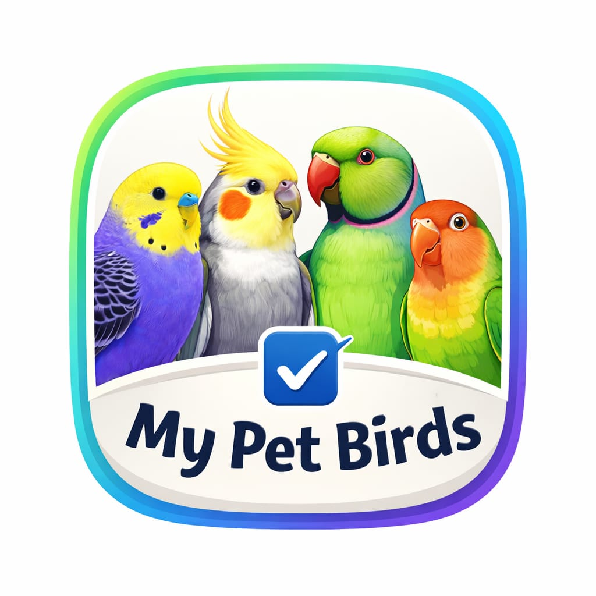
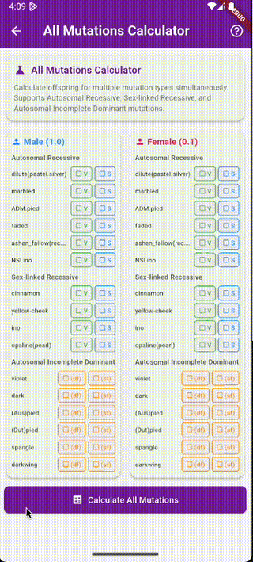

  

  <h1>My Pet Birds</h1>

  

    <strong>Scientific-Grade Genetic Calculator & Aviary Manager</strong> 
    The first mobile-side inheritance engine trusted by professional breeders for 10+ species.
  

  

    <strong>Status:</strong> 🎨 Waiting for UI/UX Design 
    (Algorithms 100% Complete & Verified)
  

  

    
    
    
    
  

---

## 🎥 Preview

  

---

## Overview

**My Pet Birds** is a professional-grade mobile ecosystem for aviculture, designed to bring scientific genetic accuracy to your pocket. It moves beyond simple tracking to offer a **Mobile-Side Inheritance Engine** that calculates complex probabilities for over 10 different bird species without requiring an internet connection.

> **Project Note**: The core genetic algorithms are fully implemented and verified. We are currently pausing for **final high-fidelity UI/UX designs** to ensure the visual experience matches the professional quality of the engineering.

---

## 🧬 Mobile-Side Inheritance Engine

The core of this application is a custom-built genetic inheritance engine designed to handle the massive complexity of avian genetics. **All algorithms are executed 100% locally on the device**, ensuring privacy and offline availability.

### Scientific-Grade Accuracy
Genetics is complex, but this app handles the heavy lifting for you. Our improved algorithm:
-   **Calculates Probabilities**: Instantly determines the exact percentage chance of any offspring (e.g., "25% Albino, 50% Grey").
-   **Prevents Errors**: Automatically blocks biologically impossible pairings (like two dominant genes that cannot exist together).
-   **Handles Complexity**: Seamlessly processes advanced cases involving **Sex-Linked**, **Recessive**, and **Dominant** genes all at once.

### Smart Validation
The app acts as a biological safeguard. It intelligently restricts your choices based on the bird's gender and species rules, ensuring that every calculation you run is scientifically valid.

---

## 🌍 Multi-Species Support

Unlike other tools limited to a single type of bird, this application provides specialized genetic calculators for a wide variety of species.

**Supported Species Include:**
*   **Cockatiels** (*Nymphicus hollandicus*)
*   **Budgerigars** (Budgies)
*   **Indian Ringnecks** (*Psittacula krameri*)
*   **Lovebirds** (*Agapornis* sp.)
*   ...and 6+ other popular avian species.

---

## 🏆 Trusted & Endorsed

We are proud to be supported by a **Famous European Birds Magazine**, recognizing the scientific accuracy and value this tool brings to the aviculture community.

---

## � Future Roadmap

We are building a complete ecosystem for aviculture, extending far beyond simple probability calculations:

-   **Aviary Manager**: A comprehensive suite to manage breeding pairs, track clutches, and log band numbers for your entire aviary.
-   **AI-Powered Recognition**: Cutting-edge artificial intelligence to automatically detect a bird's species, sex, and mutation simply by scanning a photo.

---

## 👨💻 Developer Note

This application represents a significant engineering effort to port complex scientific genetic logic to a mobile environment. The **Mobile Developer** has independently reverse-engineered the logic from established European scientific tools and implemented the full genetic algorithm to run natively on iOS devices.

---

## 📬 Contact

  
   
  
   
  

