<div align="center">

  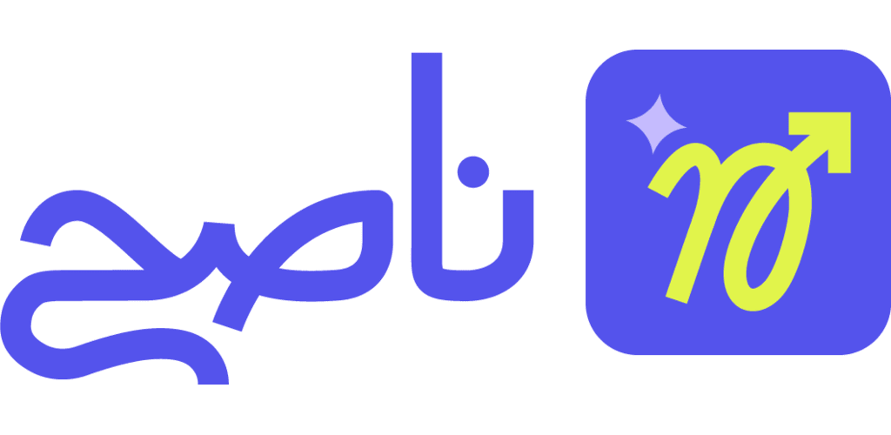

  <h1>Naseh</h1>

  <p>
    <strong>Enterprise-Grade Investment Platform for Egypt (FRA)</strong><br>
    Real-time financial data, investment calculators, and market analytics for the Financial Regulatory Authority.
  </p>

  <p>
    <strong>منصة إدارة الاستثمارات المتكاملة</strong><br>
    توفر بيانات مالية مباشرة، رسوم بيانية تفاعلية، حاسبات مالية، وتحليلات سوق شاملة تحت إشراف الهيئة العامة للرقابة المالية.
  </p>

  <p>
    <strong>Market:</strong> Egypt 🇪🇬 (Financial Regulatory Authority)
  </p>

  <p>
     <strong>⚠️ Closed Testing Status:</strong><br>
     This app is currently in <strong>Google Play Closed Testing</strong>.
     <br>Step 1: <a href="https://groups.google.com/g/naseh-testers">Join the Google Group</a> to get access.
     <br>Step 2: Download from the Store link below.
     <br><em>🚀 Coming soon to Android & iOS Public Stores</em>
  </p>

  <p align="center">
    <a href="https://play.google.com/store/apps/details?id=com.nawah.app">
      
    </a>
    <br>
    <br>
    <a href="https://drive.google.com/file/d/1UjMTOFUn8cb0AVGkVwpmst4aUFwvuJuM/view?usp=share_link">
      
    </a>
  </p>

  <p>
    
    
    
  </p>

</div>

---

## 📖 Overview

Naseh is an enterprise-grade investment management platform developed for investment channels in Egypt, operating under the Financial Regulatory Authority (FRA). The app provides real-time financial data, interactive charts, client-side calculators, and comprehensive market analytics. Built with Flutter, it features a sophisticated glassmorphism design system, custom chart implementations, and performance optimizations for handling large financial datasets.

---

## 🛠 Technology Stack

| Layer | Stack |
|---|---|
| Language | Flutter, Dart |
| State | BLoC (complex) + Cubit (simple), rxdart |
| Architecture | Clean Architecture (data + presentation) |
| Backend | PHP Laravel RESTful API |
| Networking | Dio + Retrofit, Connectivity Plus |
| Serialization | freezed, json_serializable, build_runner |
| Storage | Flutter Secure Storage, SharedPreferences |
| UI/UX | Glassmorphism design system, custom chart implementation |
| Animations | Hardware-accelerated animations, micro-interactions |
| Charts | Custom NasehLineChart (built from scratch), fl_chart extensions |
| Localization | Arabic (RTL) & English (LTR) with separate themes |
| Notifications | Firebase Cloud Messaging, Flutter Local Notifications |
| Performance | Isolates for heavy computation, RepaintBoundary optimization |

---

## ✨ Screens & Features

### 🏠 Home & Dashboard
- **Home Screen**: Overview dashboard with quick access to all investment categories
- **Real-time Updates**: Live price tickers for metals, currencies, and funds
- **Personalized Content**: User-specific recommendations and quick navigation

### 🏆 Metals Module
- **Gold Prices**: Real-time prices for 24K, 22K, 21K, 18K, 16K, 14K gold
- **Silver Prices**: Current silver market rates
- **Price Charts**: Interactive historical price charts with custom NasehLineChart
- **Metals Calculator**: Client-side calculation engine for gold/silver values (works offline)
- **Multi-Karat Support**: Calculates prices across all karat levels
- **Manufacturing Cost Estimation**: Includes Egyptian jeweler price formulas

### 💱 Currency Module
- **Exchange Rates**: Real-time rates for USD, EUR, GBP, SAR, AED
- **Currency Charts**: Historical exchange rate visualization
- **Currency Converter**: Instant bidirectional conversion (EGP ↔ currencies)
- **Rate Alerts**: Notifications for rate changes

### 📈 Investment Funds Module
- **Fund Listings**: Browse all available investment funds with advanced filtering
- **Fund Details**: Comprehensive fund information and performance metrics
- **Performance Charts**: Visual performance tracking with interactive charts
- **Fund Calculator**: Advanced compound interest calculator with daily compounding
- **Projections**: 40-year investment projections with visual charts
- **Search & Filter**: Advanced search capabilities with debouncing

### 📜 Certificates Module
- **Certificate Listings**: View all financial certificates
- **Certificate Details**: Detailed certificate information and types
- **Replacement Services**: Certificate replacement workflows
- **Language Switching**: Dynamic language change demonstration

### 🔍 Search Module
- **Global Search**: Search across all content types (metals, currencies, funds, certificates)
- **Recent Searches**: Quick access to previous searches
- **Filter Options**: Advanced filtering capabilities
- **Search Suggestions**: Intelligent search recommendations
- **Debounced Queries**: Optimized search with RxDart debouncing

### 🔐 Authentication Module
- **Registration**: User account creation with validation
- **Login**: Secure authentication with email/password
- **OTP Verification**: SMS-based one-time password verification
- **Biometric Authentication**: Face ID, Touch ID, Fingerprint support
- **Profile Management**: User profile editing and account security
- **Secure Token Storage**: Encrypted local storage for tokens

### 🔔 Notifications Module
- **Notification Center**: View all notifications with history
- **Notification Settings**: Customize notification preferences
- **Firebase FCM**: Background and foreground notification handling
- **Rich Notifications**: Images and custom layouts

### ⚙️ Settings Module
- **Theme Selection**: Light/Dark mode with separate themes for English/Arabic
- **Language Selection**: Dynamic English/Arabic switching with instant theme change
- **App Preferences**: Various app settings and configurations
- **About & Support**: App information and help

---

## 🚀 Highlights

- **Custom Chart System**: Built NasehLineChart from scratch using Flutter's canvas API — renders 1000+ data points at 60 FPS with RTL support
- **Glassmorphism Design**: Sophisticated glass card components with multi-layered effects, 100% Figma design fidelity
- **Client-Side Calculators**: Fully offline calculation engines for metals, currency, and investment funds with financial-grade precision
- **Performance Excellence**: Isolate-based heavy computation, RepaintBoundary optimization, 40-60% CPU reduction, <150MB memory footprint
- **Hybrid State Management**: Strategic use of BLoCs (complex screens) and Cubits (simple screens) with RxDart for debouncing/throttling
- **Dual Theme System**: Separate design styles for Arabic (Cairo font) and English (Montserrat font) with complete RTL support
- **Functional Error Handling**: Type-safe error handling with Dartz Either pattern and custom failure types
- **Enterprise Architecture**: Streamlined Clean Architecture (data + presentation) maintaining clean separation without boilerplate

## 🔬 Technical Excellence Showcase

<table>
<tr>
<td width="50%" valign="top">

### 📊 Custom Chart System

**Built from scratch using Flutter's Canvas API**

#### Implementation Highlights
- **NasehLineChart**: Fully custom line chart widget (no standard libraries)
- **Canvas API**: Direct rendering using `CustomPainter` for pixel-perfect control
- **Isolate-Based Processing**: Heavy computations run in separate threads to prevent UI freezing
- **RepaintBoundary Optimization**: Strategic widget isolation reduces CPU usage by 40-60%
- **Performance**: Renders 1000+ data points at smooth 60 FPS (3x faster than standard libraries)

#### Advanced Features
- **Interactive Touch Points**: Animated tooltips with visual feedback
- **Multi-Timeframe Support**: 1M, 3M, 6M, 1Y, ALL periods with smooth transitions
- **Dynamic Y-Axis Scaling**: Automatically adjusts based on data range
- **RTL Support**: Charts render correctly with reversed X-axis for Arabic
- **Full-Screen Mode**: Enhanced interactions with expanded view
- **Animated Entry Effects**: Smooth data loading animations
- **Memory Efficient**: Only visible data points rendered

#### Technical Achievements
- **Chart Render Time**: <100ms for 1000+ data points
- **Touch Response**: <16ms (1 frame) interaction latency
- **Memory per Chart**: <5MB footprint
- **Smooth Panning/Zooming**: 60 FPS maintained during interactions

</td>
<td width="50%" valign="top">

### 🧮 Client-Side Calculators

**Fully offline calculation engines — zero backend dependency**

#### Metals Calculator
- **24K Gold Fair Price**: Converts international ounce prices to EGP per gram
- **Multi-Karat Support**: 24K, 22K, 21K, 18K, 16K, 14K calculations
- **Silver Price Engine**: Separate calculation system for silver
- **Egyptian Jeweler Formulas**: Implements local market calculation methods
- **Manufacturing Costs**: Calculates total value including manufacturing expenses
- **Real-Time Updates**: Instant recalculation when rates change

#### Currency Converter
- **Multi-Currency**: USD, EUR, GBP, SAR, AED support
- **Bidirectional**: EGP ↔ Currency conversion in both directions
- **Real-Time Rates**: Uses latest exchange rates from API
- **Formatted Display**: Proper decimal formatting and thousand separators

#### Investment Fund Calculator
- **Lump Sum Investment**: One-time investment return calculations
- **Monthly Contributions**: Recurring monthly investment handling
- **Combined Mode**: Initial investment + monthly contributions
- **Daily Compounding**: Industry-standard daily interest calculation
- **40-Year Projections**: Long-term investment forecasting
- **Visual Charts**: Interactive charts display projection data

#### Calculation Accuracy
- **Financial-Grade Precision**: Industry-standard formulas throughout
- **No Rounding Errors**: Proper decimal handling with validated formulas
- **Banking Standards**: Cross-checked with financial institution calculations
- **Instant Results**: All calculations happen client-side with zero latency

</td>
</tr>
</table>

## 🏗 Visual Architecture

```text
App (Flutter) — Clean Architecture (Simplified)
├─ presentation/        # Views, BLoCs/Cubits, Widgets
└─ data/                # Models, Repositories, Network client, Local storage
```

## 📂 Project Structure

```text
lib/
├─ common/                      # Shared code
│  ├─ data/
│  │  ├─ model/                # 50+ data models (Freezed)
│  │  ├─ network/              # API client (Retrofit), token management
│  │  └─ repo/                 # Repositories (Either<Failure, Success>)
│  ├─ presentation/
│  │  ├─ view/                 # 30+ screens
│  │  └─ widget/               # 200+ reusable widgets
│  ├─ shared/                  # Utilities, routing, theme (dual), DB helper
│  │  └─ bloc/                    # BLoCs (complex) and Cubits (simple)
├─ features/                    # Feature modules
│  ├─ home/
│  ├─ metals/                   # Metals tracking, charts, calculator
│  ├─ currency/                 # Exchange rates, converter, charts
│  ├─ funds/                    # Investment funds, charts, calculator
│  ├─ certificates/             # Financial certificates
│  ├─ search/                   # Global search with debouncing
│  ├─ auth/                     # Authentication, biometric
│  ├─ notifications/            # FCM, notification center
│  └─ settings/                 # Theme, language, preferences
└─ core/                        # Core utilities, constants
```

---

## 📸 Screenshots

<table>
  <tr>
    <td>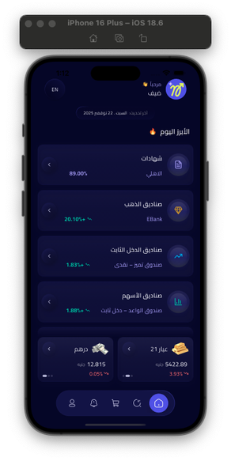</td>
    <td>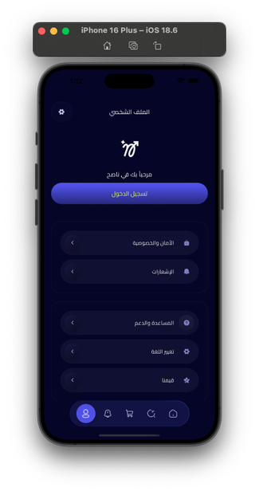</td>
    <td>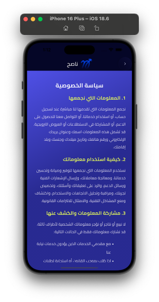</td>
  </tr>
  <tr>
    <td>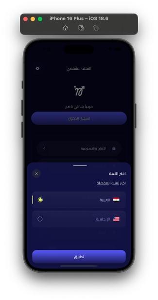</td>
    <td>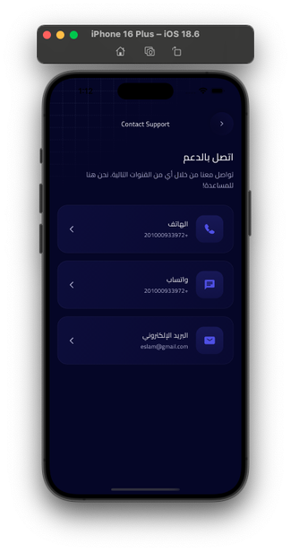</td>
    <td>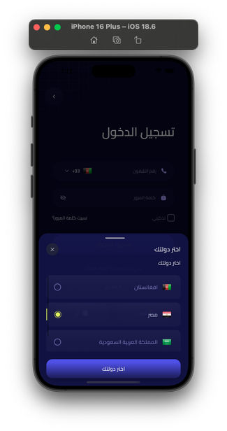</td>
  </tr>
  <tr>
    <td>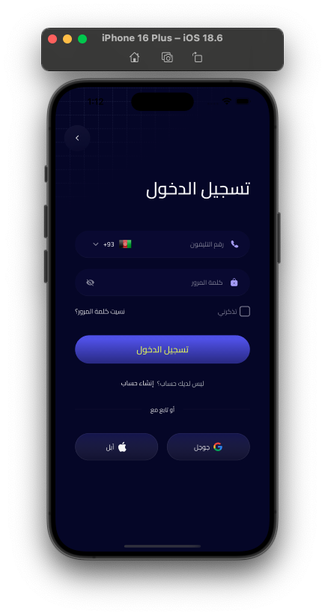</td>
    <td>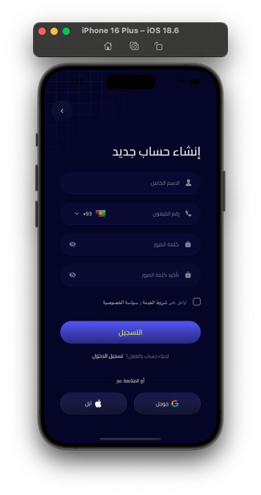</td>
    <td>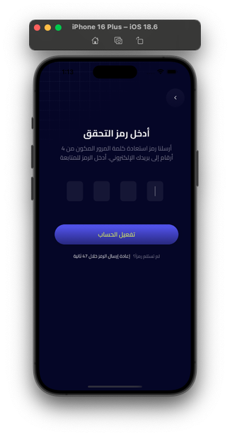</td>
  </tr>
  <tr>
    <td>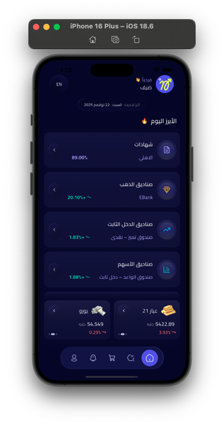</td>
    <td>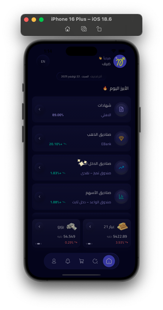</td>
    <td>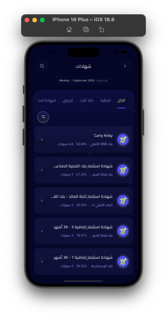</td>
  </tr>
  <tr>
    <td>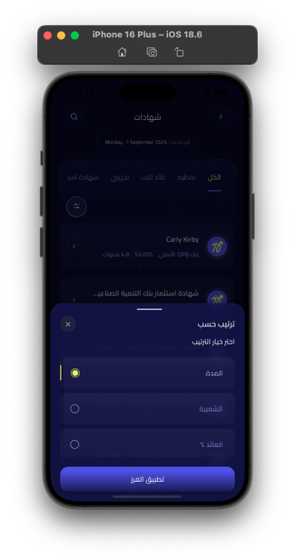</td>
    <td>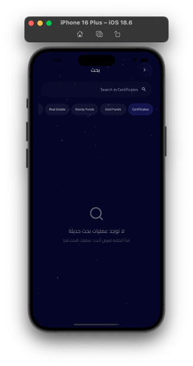</td>
    <td>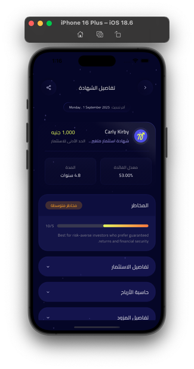</td>
  </tr>
  <tr>
    <td>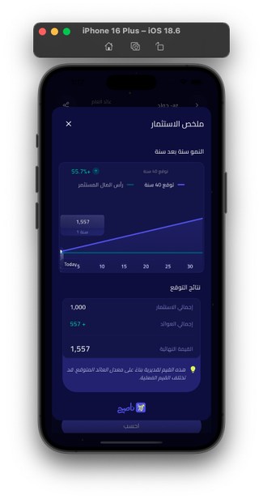</td>
    <td>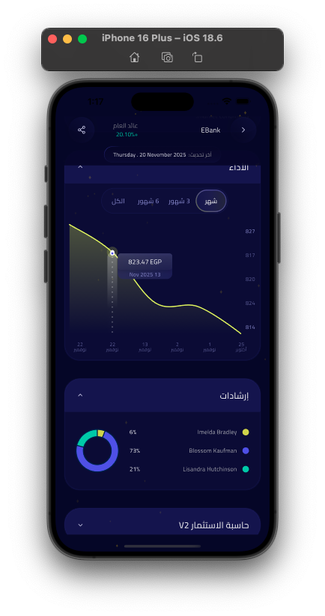</td>
    <td>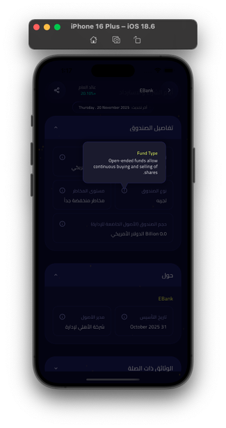</td>
  </tr>
</table>

> *Check the `assets/images/screenshots` folder for the full gallery.*

---

## 🎥 Full Demo

<div align="center">
  <a href="https://drive.google.com/file/d/1UjMTOFUn8cb0AVGkVwpmst4aUFwvuJuM/view?usp=share_link">
    
  </a>
</div>

---

## 📬 Contact

<div align="center">
  <a href="mailto:eng.ashrf100@gmail.com?subject=Naseh%20Inquiry">
    
  </a>
  <br>
  <a href="https://www.linkedin.com/in/ashrf-atia-mostafa-92538a318/">
    
  </a>
  <br>
  <a href="https://wa.me/201287200535">
    
  </a>
</div>


